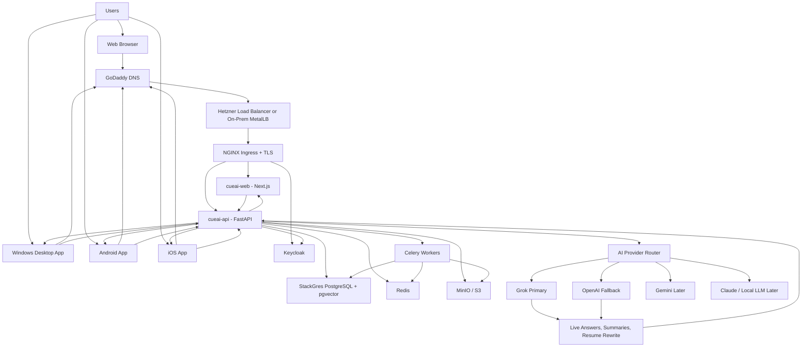
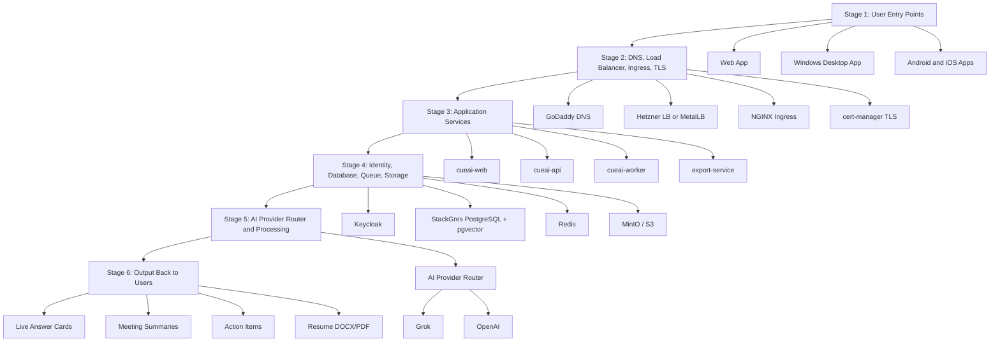
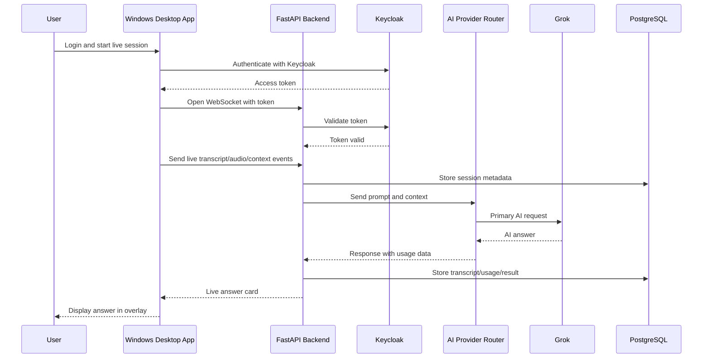
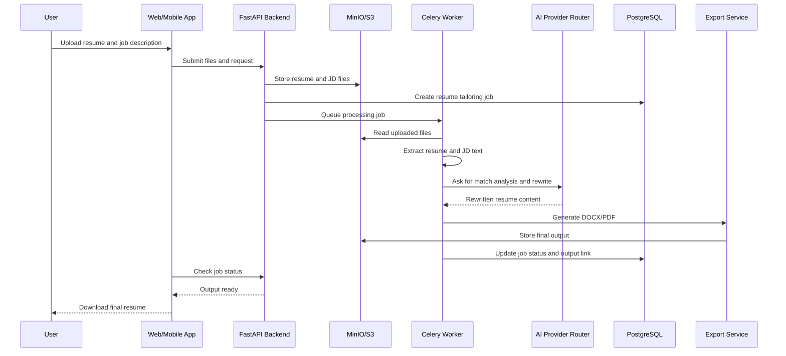
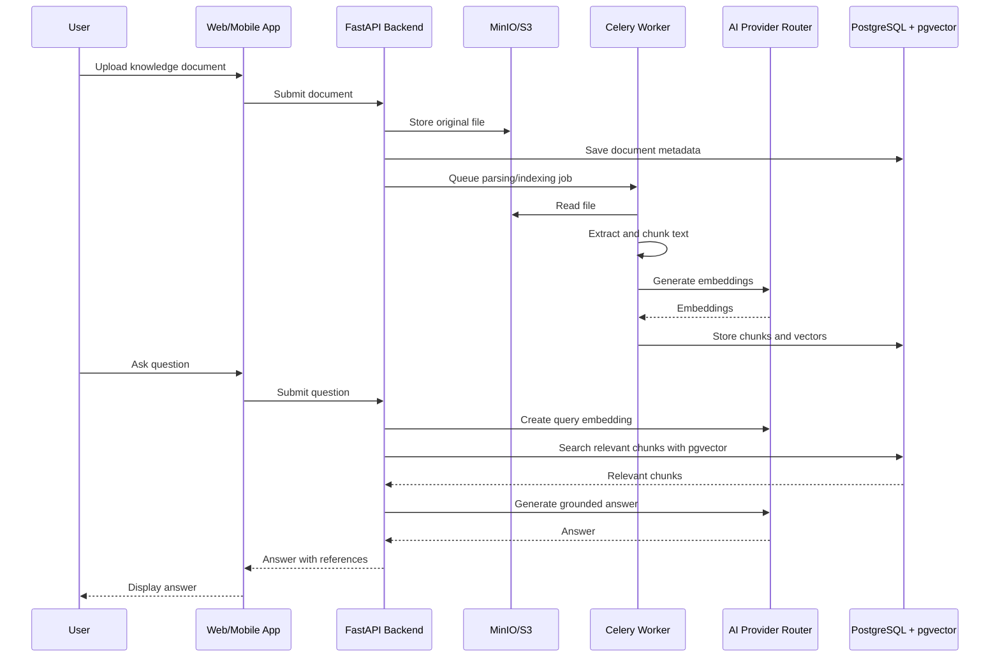
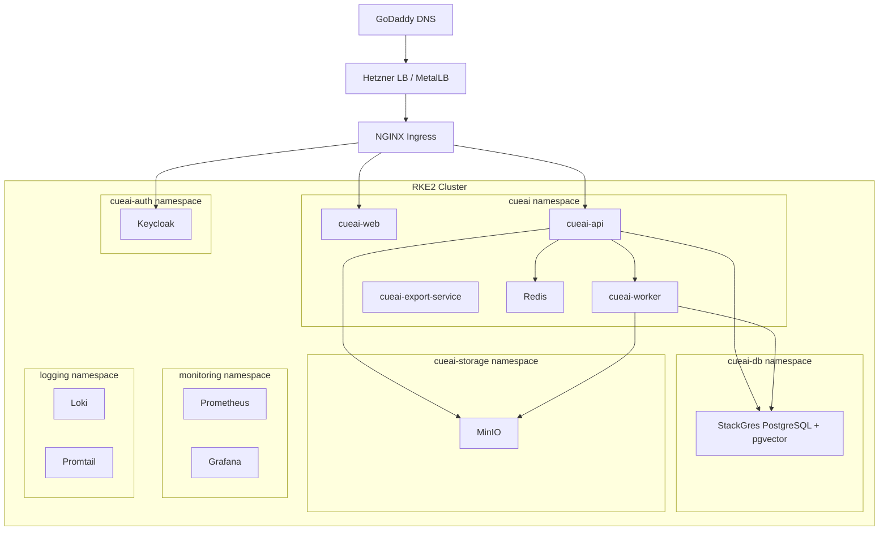

# CueAI Architecture - Web Desktop Mobile and Platform

Source: Confluence space CueAI (wayfinderops.atlassian.net)  
Exported for NotebookLM

---

# CueAI Architecture - Web Desktop Mobile and Platform

## Purpose

This parent page defines the CueAI MVP v1.0 architecture across Web, Windows Desktop, Android, iOS, Backend, AI services, and RKE2 platform deployment.

## Architecture Scope

| Client | Platform | Main Usage |
| --- | --- | --- |
| Web App | Browser | Dashboard, admin, meeting history, knowledge base, resume tailor |
| Windows Desktop App | Windows | Live Copilot, overlay, audio/session control, screen context with user permission |
| Android App | Android mobile | Mobile dashboard, notes, summaries, resume tailor, notifications |
| iOS App | iPhone/iPad | Mobile dashboard, notes, summaries, resume tailor, notifications |

## Clickable Child Page Index

| # | Page | Purpose |
| --- | --- | --- |
| 01 | Overall System Architecture | Complete high-level architecture and data flow |
| 02 | Web App Architecture | Web dashboard and admin portal architecture |
| 03 | Windows Desktop App Architecture | Windows desktop live copilot architecture |
| 04 | Mobile App Architecture - Android and iOS | Android and iOS app architecture |
| 05 | Backend and AI Architecture | FastAPI, WebSocket, AI router, RAG, resume tailor, and workers |
| 06 | Platform Deployment Architecture | RKE2, Hetzner/on-prem, ingress, StackGres, MinIO, monitoring, logging |
| 07 | Visual Architecture Flow Diagram | Stage-by-stage plaintext and Mermaid flow diagrams |
| 08 | Mermaid Architecture Diagrams | Full Mermaid diagram set for system, flows, and RKE2 layout |

## High-Level Architecture

```plaintext
Users
  |
  |-- Web Browser
  |-- Windows Desktop App
  |-- Android App
  |-- iOS App
        |
        v
NGINX Ingress / TLS
        |
        v
CueAI Backend API - FastAPI
        |
        |-- Keycloak Auth
        |-- PostgreSQL + pgvector - StackGres
        |-- Redis + Celery Workers
        |-- MinIO / S3 Storage
        |-- AI Provider Router
              |-- Grok Primary
              |-- OpenAI Fallback
              |-- Gemini / Claude / Local LLM Later
```

## Architecture Principles

| Principle | Decision |
| --- | --- |
| API-first | All clients use common backend APIs |
| Provider abstraction | All AI calls go through AI Provider Router |
| Permission-based desktop features | Audio/screen features require clear user control |
| Shared identity | Keycloak manages authentication across all clients |
| Shared backend | Web, desktop, Android, and iOS use same FastAPI backend |
| Centralized storage | PostgreSQL, pgvector, Redis, and MinIO serve all clients |
| Kubernetes-first deployment | RKE2 is the platform for Hetzner and on-prem |
| MVP simplicity | Jenkins + Helm first, Argo CD later |

## Final Decision

CueAI architecture will use a single backend and platform layer serving multiple clients:

* Web App
* Windows Desktop App
* Android App
* iOS App

All clients will authenticate through Keycloak and communicate with FastAPI over HTTPS/WebSocket.

---

# 01 - Overall System Architecture

## Purpose

This page defines the high-level CueAI architecture across all clients and backend services.

## Client Channels

| Client | Platform | Communication | Main Features |
| --- | --- | --- | --- |
| Web App | Browser | HTTPS | Dashboard, admin, meeting history, knowledge base, resume tailor |
| Windows Desktop App | Windows | HTTPS + WebSocket | Live Copilot, overlay, audio/session control, screen context with user permission |
| Android App | Android | HTTPS | Mobile dashboard, notes, summaries, resume tailor, notifications |
| iOS App | iPhone/iPad | HTTPS | Mobile dashboard, notes, summaries, resume tailor, notifications |

## High-Level Flow

```plaintext
User Clients
  |
  |-- Web App
  |-- Windows Desktop App
  |-- Android App
  |-- iOS App
        |
        v
Public DNS - GoDaddy
        |
        v
NGINX Ingress + TLS
        |
        v
FastAPI Backend
        |
        |-- Auth validation with Keycloak
        |-- Live WebSocket session service
        |-- Meeting service
        |-- Resume tailor service
        |-- Knowledge base service
        |-- AI provider router
        |-- Usage tracking service
        |
        |-- PostgreSQL + pgvector via StackGres
        |-- Redis queue/cache
        |-- Celery workers
        |-- MinIO/S3 storage
        |
        |-- Grok primary AI
        |-- OpenAI fallback AI
```

## Core Architecture Decisions

| Area | Decision |
| --- | --- |
| Backend pattern | Single backend API shared by all clients |
| Authentication | Keycloak OIDC/OAuth2 |
| AI integration | AI Provider Router with Grok primary and OpenAI fallback |
| Live updates | WebSocket for live desktop sessions |
| Background work | Celery workers with Redis |
| Database | PostgreSQL with pgvector managed by StackGres |
| File storage | MinIO for MVP, S3-compatible storage later |
| Deployment | RKE2 on Hetzner or on-prem |

## Primary Data Flows

| Flow | Description |
| --- | --- |
| Login Flow | Client redirects to Keycloak, receives token, calls FastAPI with token |
| Live Copilot Flow | Desktop sends live session events to FastAPI over WebSocket |
| AI Answer Flow | Backend sends prompt/context to AI Provider Router, Grok responds, OpenAI fallback if needed |
| Knowledge Base Flow | User uploads docs, worker parses and stores embeddings in pgvector |
| Resume Flow | User uploads resume/JD, worker extracts content, AI rewrites, export service creates output |
| Meeting Notes Flow | Transcript stored, worker generates summary/action items, dashboard shows results |

## Non-Functional Requirements

| Requirement | MVP Decision |
| --- | --- |
| Cost control | Track AI usage per user/workspace/provider |
| Scalability | Scale API and workers separately |
| Security | Keycloak auth and protected configuration through Sealed Secrets |
| Observability | Prometheus, Grafana, Loki with one-day dev retention |
| Portability | Helm charts support Hetzner and on-prem RKE2 |
| Maintainability | API-first architecture and shared backend services |

---

# 02 - Web App Architecture

## Purpose

This page defines the CueAI web dashboard and admin portal architecture.

## Web App Stack

| Layer | Technology | Usage |
| --- | --- | --- |
| Web Framework | Next.js | Dashboard and admin portal |
| Language | TypeScript | Type-safe web development |
| Styling | Tailwind CSS | Responsive UI and design system |
| Auth Client | Keycloak OIDC client | Login and token handling |
| API Client | HTTPS REST client | Calls FastAPI backend APIs |
| Live Updates | WebSocket client where needed | Session updates, live events later |
| Testing | Playwright / Vitest | UI tests and smoke tests |

## Web App Modules

| Module | Usage |
| --- | --- |
| Login | Keycloak login and callback handling |
| Dashboard Home | Overview of meetings, usage, resumes, knowledge base |
| Meeting History | List and view transcripts, summaries, action items |
| Knowledge Base | Upload and manage company documents |
| Resume Tailor | Upload resume, paste/upload JD, view rewrite results |
| Admin Dashboard | Manage users, workspace settings, feature flags, provider settings |
| Usage Dashboard | Show AI usage by user/workspace/provider/feature |
| Settings | Privacy, retention, provider preferences |

## Web Architecture Flow

```plaintext
Browser
  |
  v
Next.js Web App
  |
  |-- Keycloak login redirect
  |-- Stores session/token securely
  |-- Calls FastAPI APIs
  |-- Uploads files to backend/storage flow
  |
  v
FastAPI Backend
  |
  |-- PostgreSQL
  |-- MinIO/S3
  |-- AI Provider Router
  |-- Celery Workers
```

## Web Routing Plan

| Route | Purpose |
| --- | --- |
| /login | Login redirect/landing |
| /dashboard | Main user dashboard |
| /meetings | Meeting list |
| /meetings/[id] | Meeting detail, transcript, summary, actions |
| /knowledge-base | Document upload and management |
| /resume-tailor | Resume rewrite workflow |
| /admin | Admin dashboard |
| /settings | User/workspace settings |

## Web App Responsibilities

| Responsibility | Decision |
| --- | --- |
| Authentication | Use Keycloak OIDC flow |
| Authorization | Show/hide pages based on roles from backend/auth claims |
| File Upload | Upload via backend API first; direct S3 upload can be later |
| API Handling | Use typed API client generated or manually maintained from OpenAPI |
| Error Handling | Show user-friendly error messages and log backend errors |
| Feature Flags | Fetch enabled features from backend |
| Responsive Design | Support laptop/desktop first, tablet later |

## Not in Web MVP

| Item | Reason |
| --- | --- |
| Complex billing portal | Usage tracking is enough initially |
| Full white-labeling | Can be added after customer validation |
| Offline web mode | Not required for MVP |
| Advanced analytics | Basic usage dashboard is enough initially |

---

# 03 - Windows Desktop App Architecture

## Purpose

This page defines the Windows desktop application architecture for CueAI Live Copilot.

## Desktop Stack

| Layer | Technology | Usage |
| --- | --- | --- |
| Desktop Runtime | Electron | Windows desktop app shell |
| UI | React + TypeScript | Desktop interface, overlay, controls |
| Backend Communication | HTTPS + WebSocket | API calls and live session streaming |
| Authentication | Keycloak OIDC | Login and token handling |
| Audio Session | Desktop audio/microphone module | Meeting/session audio input where supported |
| Screen Context | User-triggered screen capture/OCR | Analyze visible content with user permission |
| Local State | Secure local config/session cache | Store non-sensitive app preferences |
| Packaging | Electron builder or equivalent | Windows installer generation |

## Desktop App Modules

| Module | Usage |
| --- | --- |
| Login Module | Authenticate user with Keycloak |
| Session Controller | Start/stop live session |
| Overlay UI | Show live answers, prompts, controls |
| Hotkey Manager | User shortcuts for opening, hiding, or controlling app |
| Audio Controller | Capture selected audio/microphone input where permitted |
| Screen Context Controller | User-triggered screen analysis |
| WebSocket Client | Stream session events and receive AI updates |
| Settings | Audio device, provider mode, privacy, feature toggles |
| Auto Logs | App-side diagnostic logs for troubleshooting |

## Desktop Architecture Flow

```plaintext
Windows User
  |
  v
CueAI Electron Desktop App
  |
  |-- Login via Keycloak
  |-- Start live session
  |-- Capture permitted audio/session input
  |-- Capture screen context only on user action
  |-- Send events to FastAPI over WebSocket
  |-- Receive transcript/AI answer cards
  |-- Display overlay UI
  |
  v
FastAPI Backend
  |
  |-- Transcription service
  |-- AI Provider Router
  |-- PostgreSQL session storage
  |-- Usage tracking
```

## Desktop Session Flow

| Step | Action |
| --- | --- |
| 1 | User logs in through Keycloak |
| 2 | Desktop app receives authorized session |
| 3 | User starts CueAI live session |
| 4 | App opens WebSocket connection to backend |
| 5 | App sends allowed live events/audio chunks/context |
| 6 | Backend processes transcript and AI answer |
| 7 | Desktop app shows live answer card |
| 8 | User stops session |
| 9 | Backend stores summary and action items |

## Desktop MVP Features

| Feature | MVP Decision |
| --- | --- |
| Floating overlay | Required |
| Always-on-top mode | Required |
| Hotkeys | Required |
| Start/stop session | Required |
| Live answer cards | Required |
| Manual screen analyze | Required |
| Automatic screen analysis | Later |
| Desktop auto-update | Later |
| Windows first | Required |
| macOS/Linux | Later |

## Desktop Privacy and Control Rules

| Rule | Decision |
| --- | --- |
| User control | User must start/stop sessions |
| Screen context | Triggered with clear user action for MVP |
| Audio controls | User selects permitted input source |
| Local storage | Do not store sensitive tokens or content unnecessarily |
| Logs | Diagnostic logs should avoid sensitive meeting content |
| Settings | User can disable screen context and audio features |

## Desktop Risks

| Risk | Impact | Mitigation |
| --- | --- | --- |
| Audio capture differs by Windows device/app | High | Validate early in Sprint 0 |
| Overlay behavior differs by meeting app | Medium | Test Zoom, Teams, Google Meet |
| WebSocket latency affects UX | Medium | Use streaming and lightweight payloads |
| Installer signing may be needed | Medium | Manual installer first; code signing later |
| Screen OCR accuracy varies | Medium | Manual Analyze Screen first, vision model later |

---

# 04 - Mobile App Architecture - Android and iOS

## Purpose

This page defines the Android and iOS mobile application architecture for CueAI.

## Mobile MVP Decision

For MVP, mobile apps should focus on dashboard and productivity workflows, not live desktop overlay features.

| Platform | MVP Scope |
| --- | --- |
| Android | Mobile dashboard, meeting notes, summaries, resume tailor, notifications |
| iOS | Mobile dashboard, meeting notes, summaries, resume tailor, notifications |

## Mobile Stack Options

| Option | Decision | Reason |
| --- | --- | --- |
| React Native | Recommended for MVP | One shared codebase for Android and iOS |
| Flutter | Good alternative | Strong UI, but team must be comfortable with Dart |
| Native Android + Native iOS | Later only | More effort and two separate codebases |

## Recommended Mobile Stack

| Layer | Technology | Usage |
| --- | --- | --- |
| Mobile Framework | React Native | Android and iOS shared mobile app |
| Language | TypeScript | Shared mobile codebase |
| Auth | Keycloak OIDC | Login and token handling |
| API Communication | HTTPS REST | Calls FastAPI backend |
| Push Notifications | Firebase Cloud Messaging / APNs | Mobile alerts later |
| Local Storage | Secure storage | Store limited session/app preferences |
| Testing | Mobile smoke tests | Validate login and core flows |

## Mobile App Modules

| Module | Usage |
| --- | --- |
| Login | Keycloak authentication |
| Home Dashboard | Meeting/resume/knowledge overview |
| Meeting Notes | View meeting summaries and action items |
| Resume Tailor | Upload/view resume rewrite results |
| Knowledge Base | View/search uploaded documents later |
| Notifications | Reminders and summary-ready alerts later |
| Settings | Account, privacy, retention, feature preferences |

## Mobile Architecture Flow

```plaintext
Android / iOS App
  |
  |-- Login using Keycloak
  |-- Call FastAPI over HTTPS
  |-- Upload files through backend flow
  |-- View meeting notes and resume outputs
  |-- Receive notifications later
  |
  v
FastAPI Backend
  |
  |-- PostgreSQL
  |-- MinIO/S3
  |-- AI Provider Router
  |-- Celery Workers
```

## Mobile API Usage

| API Area | Usage |
| --- | --- |
| Auth/session | Validate user session |
| Meetings | List meetings and view summaries |
| Resume Tailor | Submit resume/JD and view output |
| Knowledge Base | List/search docs later |
| Settings | Read/update user preferences |
| Notifications | Register device token later |

## Not in Mobile MVP

| Item | Reason |
| --- | --- |
| Live meeting overlay | Desktop-only feature for MVP |
| System audio capture | Mobile OS restrictions and complexity |
| Screen analysis | Desktop-first feature |
| Full offline mode | Not required for MVP |
| Native Android/iOS separate codebases | React Native is faster for MVP |

## Mobile Risks

| Risk | Impact | Mitigation |
| --- | --- | --- |
| Keycloak mobile login flow needs testing | Medium | Validate early with Android and iOS build |
| File upload handling differs by OS | Medium | Use standard document picker and backend upload |
| Push notifications add complexity | Low for MVP | Keep as later feature |
| App store release process takes time | Medium | Use internal testing/TestFlight first |

---

# 05 - Backend and AI Architecture

## Purpose

This page defines the backend, AI, RAG, resume tailor, and worker architecture for CueAI MVP v1.0.

## Backend Stack

| Layer | Technology | Usage |
| --- | --- | --- |
| API Framework | Python FastAPI | REST APIs and WebSocket APIs |
| Auth Validation | Keycloak OIDC/JWT validation | Validate user and workspace access |
| Database | PostgreSQL | Users, workspaces, sessions, transcripts, resumes, audit logs |
| Vector Search | pgvector | Knowledge base semantic search |
| Queue | Redis | Celery broker/cache |
| Worker | Celery | Background processing |
| File Storage | MinIO/S3 | Uploaded documents, resumes, exports |
| AI Router | Provider abstraction layer | Route AI requests to Grok/OpenAI/future providers |
| Primary AI | Grok | Development and MVP default provider |
| Fallback AI | OpenAI | Quality fallback and unsupported tasks |

## Backend Services

| Service | Responsibility |
| --- | --- |
| Auth Service | Validate tokens and map users/workspaces/roles |
| User/Workspace Service | Users, workspace membership, roles |
| Session Service | Live session lifecycle and metadata |
| Transcript Service | Store and retrieve transcripts |
| Meeting Summary Service | Generate summaries and action items |
| Knowledge Base Service | Document upload, parsing, chunking, embeddings, search |
| Resume Tailor Service | Resume parsing, JD analysis, rewrite, export |
| AI Provider Router | Common interface for Grok, OpenAI, Gemini, Claude, local LLM later |
| Usage Tracking Service | Store token usage and feature usage |
| Feature Flag Service | Enable/disable features per workspace |
| Audit Log Service | Track important user/admin events |

## Backend Architecture Flow

```plaintext
Clients
  |
  v
FastAPI API Gateway Layer
  |
  |-- Auth validation
  |-- REST APIs
  |-- WebSocket APIs
  |-- Request validation
  |
  v
Domain Services
  |
  |-- Sessions
  |-- Meetings
  |-- Knowledge Base
  |-- Resume Tailor
  |-- Usage Tracking
  |-- Feature Flags
  |
  v
Infrastructure Services
  |
  |-- PostgreSQL + pgvector
  |-- Redis
  |-- Celery Workers
  |-- MinIO/S3
  |-- AI Provider Router
```

## AI Provider Router

| Function | Description |
| --- | --- |
| generate_answer | Generate live answers from transcript/context |
| summarize_meeting | Generate meeting summary and action items |
| rewrite_resume | Rewrite resume based on job description |
| analyze_screen_text | Analyze OCR/screen text context |
| translate_text | Translate meeting text later |
| create_embedding | Create embeddings for RAG |
| fallback_provider | Retry with fallback provider if primary fails |

## AI Flow

```plaintext
Backend Service
  |
  v
AI Provider Router
  |
  |-- Grok Provider - primary
  |-- OpenAI Provider - fallback
  |-- Gemini Provider - later
  |-- Claude Provider - later
  |-- Local LLM Provider - later
        |
        v
Usage Tracking
  |
  v
Response to Client
```

## Knowledge Base / RAG Flow

| Step | Action |
| --- | --- |
| 1 | User uploads document from web/mobile |
| 2 | File stored in MinIO/S3 |
| 3 | Celery worker extracts text |
| 4 | Worker chunks document content |
| 5 | AI provider creates embeddings |
| 6 | Embeddings stored in PostgreSQL pgvector |
| 7 | User asks question |
| 8 | Backend retrieves relevant chunks |
| 9 | AI generates answer using retrieved context |

## Resume Tailor Flow

| Step | Action |
| --- | --- |
| 1 | User uploads resume and job description |
| 2 | Backend stores files in MinIO/S3 |
| 3 | Worker extracts resume and JD text |
| 4 | AI compares skills, keywords, and gaps |
| 5 | AI rewrites resume using user-provided facts |
| 6 | Export service generates DOCX/PDF |
| 7 | User downloads final output |

## Backend Data Stores

| Data | Store |
| --- | --- |
| Users/workspaces/roles | PostgreSQL |
| Sessions/transcripts | PostgreSQL |
| Meeting summaries/action items | PostgreSQL |
| Knowledge documents metadata | PostgreSQL |
| Embeddings | PostgreSQL pgvector |
| Uploaded files | MinIO/S3 |
| Resume exports | MinIO/S3 |
| Background jobs | Redis/Celery |
| Usage tracking | PostgreSQL |
| Audit logs | PostgreSQL |

## Backend MVP Rules

| Rule | Decision |
| --- | --- |
| DB schema changes | Alembic migrations only |
| AI calls | Must use AI Provider Router |
| Usage tracking | Required for all AI calls |
| File upload | Backend-mediated upload for MVP |
| WebSocket | Required for live desktop sessions |
| Rate limits | Basic user/workspace-level limits |
| Feature flags | Workspace-level feature toggles |
| Audit logs | Required for admin and key user actions |

---

# 06 - Platform Deployment Architecture

## Purpose

This page defines the CueAI deployment architecture for RKE2 on Hetzner Cloud and on-prem environments.

## Platform Stack

| Layer | Technology | Usage |
| --- | --- | --- |
| Kubernetes | RKE2 | Main platform for CueAI workloads |
| Cloud | Hetzner Cloud | VM hosting, volumes, load balancer |
| On-Prem | RKE2 on customer servers | Private/customer deployment path |
| Ingress | NGINX Ingress | Expose web, API, auth, monitoring endpoints |
| TLS | cert-manager | TLS certificates |
| DNS | GoDaddy | Domain and subdomain management |
| Database | StackGres PostgreSQL | PostgreSQL + pgvector on Kubernetes |
| Cache/Queue | Redis | Celery broker/cache |
| Object Storage | MinIO | S3-compatible storage for MVP |
| Auth | Keycloak | OIDC/OAuth2 identity provider |
| CI/CD | Bitbucket + Jenkins + Docker Hub + Helm | Build and deploy flow |
| Config Protection | Sealed Secrets | Protected Kubernetes configuration stored in Git |
| Metrics | Prometheus + Grafana | Monitoring with one-day dev retention |
| Logs | Loki + Promtail | Logs with one-day dev retention |

## Deployment Architecture

```plaintext
GoDaddy DNS
  |
  v
Hetzner Load Balancer or On-Prem MetalLB
  |
  v
NGINX Ingress Controller
  |
  |-- app.domain.com       -> cueai-web
  |-- api.domain.com       -> cueai-api
  |-- auth.domain.com      -> keycloak
  |-- grafana.domain.com   -> grafana
  |-- storage.domain.com   -> minio if exposed
        |
        v
RKE2 Cluster
  |
  |-- cueai namespace
  |     |-- cueai-web
  |     |-- cueai-api
  |     |-- cueai-worker
  |     |-- cueai-export-service
  |
  |-- cueai-db namespace
  |     |-- StackGres PostgreSQL + pgvector
  |
  |-- cueai-auth namespace
  |     |-- Keycloak
  |
  |-- cueai-storage namespace
  |     |-- MinIO
  |
  |-- monitoring namespace
  |     |-- Prometheus
  |     |-- Grafana
  |
  |-- logging namespace
        |-- Loki
        |-- Promtail
```

## Namespace Plan

| Namespace | Purpose | Main Components |
| --- | --- | --- |
| cueai | Application workloads | web, api, worker, export service |
| cueai-db | Database | StackGres PostgreSQL |
| cueai-auth | Authentication | Keycloak |
| cueai-storage | Object storage | MinIO |
| ingress-nginx | Ingress | NGINX Ingress Controller |
| cert-manager | TLS | cert-manager |
| monitoring | Metrics | Prometheus, Grafana |
| logging | Logs | Loki, Promtail |
| sealed-secrets | Config protection | Sealed Secrets controller |

## CI/CD Flow

```plaintext
Developer pushes code to Bitbucket
        |
        v
Jenkins pipeline starts
        |
        v
Run tests and Trivy scan
        |
        v
Build Docker images
        |
        v
Push images to Docker Hub
        |
        v
Run Helm upgrade to RKE2
        |
        v
CueAI services updated
```

## Helm Release Plan

| Release | Namespace | Purpose |
| --- | --- | --- |
| cueai-web | cueai | Web dashboard |
| cueai-api | cueai | Backend API |
| cueai-worker | cueai | Celery worker |
| cueai-export-service | cueai | Resume/document export |
| keycloak | cueai-auth | Authentication |
| minio | cueai-storage | Object storage |
| redis | cueai | Queue/cache |
| stackgres | stackgres/cueai-db | PostgreSQL operator and DB cluster |
| monitoring | monitoring | Prometheus/Grafana |
| logging | logging | Loki/Promtail |

## Environment Deployment Plan

| Environment | Deployment Type | Replicas | Retention | Notes |
| --- | --- | --- | --- | --- |
| Dev | RKE2 low-cost | 1 per service | 1 day logs/metrics | Fast MVP development |
| Staging | RKE2 closer to prod | 2 for app/API | 3 to 7 days later | Customer demo and QA |
| Prod | RKE2 hardened | 2+ app, 3+ API, HA DB | Customer-defined | Add hardening before launch |

## Storage and Backup Plan

| Component | Dev Decision | Prod Later |
| --- | --- | --- |
| PostgreSQL | StackGres single instance | StackGres HA cluster |
| pgvector | Enabled and validated | Enabled and monitored |
| MinIO | Single instance | Distributed MinIO or external S3 |
| DB Backup | pg_dump or StackGres backup to MinIO | S3/Hetzner Storage Box |
| File Backup | MinIO bucket backup | External object storage/replication |

## Ingress and DNS Plan

| Subdomain | Target | Usage |
| --- | --- | --- |
| app.domain.com | cueai-web | Web dashboard |
| api.domain.com | cueai-api | Backend API |
| auth.domain.com | keycloak | Authentication |
| grafana.domain.com | grafana | Monitoring dashboard |
| storage.domain.com | minio | Object storage console/API if exposed |

## Platform MVP Rules

| Rule | Decision |
| --- | --- |
| Deployment | Jenkins + Helm for MVP |
| GitOps | Argo CD later |
| NetworkPolicy | Skip for dev, add before production hardening |
| Monitoring | One-day retention for dev |
| Logs | One-day retention for dev |
| Secrets/config | Sealed Secrets |
| Image registry | Docker Hub |
| Domain | GoDaddy DNS |
| PostgreSQL | StackGres |
| Object storage | MinIO first |

## Platform Risks

| Risk | Impact | Mitigation |
| --- | --- | --- |
| Direct Jenkins deployment can drift from Git | Medium | Keep Helm values and release notes in Bitbucket |
| Dev retention too short for older debugging | Low | Increase retention in staging/prod |
| Single instance dev services are not HA | Low for dev | Add HA before production |
| MinIO inside cluster needs backup | Medium | Use backup bucket or external storage later |
| pgvector with StackGres must be validated | High | Validate in Sprint 0 |

---

# 07 - Visual Architecture Flow Diagram

## Purpose

This page provides a visual, stage-by-stage architecture flow for CueAI MVP v1.0. It is designed to explain how Web, Windows Desktop, Android, iOS, Backend, AI, and Platform components interact.

## Visual Flow - Stage by Stage

```plaintext
┌──────────────────────────────────────────────────────────────────────┐
│ STAGE 1: USER ENTRY POINTS                                           │
├──────────────────────────────────────────────────────────────────────┤
│                                                                      │
│   Web Browser        Windows Desktop        Android App       iOS App │
│       │                    │                    │              │      │
│       └──────────────┬─────┴──────────────┬────┴──────────────┘      │
│                      │                    │                           │
└──────────────────────┼────────────────────┼───────────────────────────┘
                       │                    │
                       v                    v
┌──────────────────────────────────────────────────────────────────────┐
│ STAGE 2: DOMAIN, TLS, AND INGRESS                                    │
├──────────────────────────────────────────────────────────────────────┤
│                                                                      │
│   GoDaddy DNS  →  Hetzner LB / MetalLB  →  NGINX Ingress  →  TLS     │
│                                                                      │
│   app.domain.com      api.domain.com      auth.domain.com             │
│                                                                      │
└──────────────────────────────────────────────────────────────────────┘
                       │
                       v
┌──────────────────────────────────────────────────────────────────────┐
│ STAGE 3: APPLICATION SERVICES                                        │
├──────────────────────────────────────────────────────────────────────┤
│                                                                      │
│   cueai-web       cueai-api       cueai-worker       export-service   │
│      │               │                │                   │           │
│      └───────────────┴────────────────┴───────────────────┘           │
│                              │                                       │
└──────────────────────────────┼───────────────────────────────────────┘
                               │
                               v
┌──────────────────────────────────────────────────────────────────────┐
│ STAGE 4: IDENTITY, DATA, QUEUE, AND STORAGE                          │
├──────────────────────────────────────────────────────────────────────┤
│                                                                      │
│   Keycloak      StackGres PostgreSQL + pgvector      Redis            │
│      │                    │                         │                 │
│      │                    │                         │                 │
│      └──────────────┬─────┴──────────────┬──────────┘                 │
│                     │                    │                            │
│                 MinIO / S3 Storage       │                            │
│                                                                      │
└─────────────────────┼────────────────────┼────────────────────────────┘
                      │                    │
                      v                    v
┌──────────────────────────────────────────────────────────────────────┐
│ STAGE 5: AI AND PROCESSING                                           │
├──────────────────────────────────────────────────────────────────────┤
│                                                                      │
│   AI Provider Router                                                 │
│      │                                                               │
│      ├── Grok Primary                                                │
│      ├── OpenAI Fallback                                             │
│      ├── Gemini Later                                                │
│      └── Claude / Local LLM Later                                    │
│                                                                      │
│   Processing: Live answers, summaries, RAG, resume rewrite, OCR       │
│                                                                      │
└──────────────────────────────────────────────────────────────────────┘
                       │
                       v
┌──────────────────────────────────────────────────────────────────────┐
│ STAGE 6: OUTPUT BACK TO USERS                                        │
├──────────────────────────────────────────────────────────────────────┤
│                                                                      │
│   Live answer cards → Meeting summaries → Action items → Resume files │
│                                                                      │
│   Web Dashboard / Desktop Overlay / Android App / iOS App             │
│                                                                      │
└──────────────────────────────────────────────────────────────────────┘
```

## Animated Flow Storyboard

This table can be used to create a GIF-style architecture animation later.

| Frame | Animation Step | What Appears | Message |
| --- | --- | --- | --- |
| 1 | User channels appear | Web, Windows Desktop, Android, iOS | CueAI supports multiple clients |
| 2 | Traffic moves to platform edge | GoDaddy DNS, Load Balancer, NGINX Ingress, TLS | All traffic enters securely |
| 3 | Backend services appear | Web, API, worker, export service | Application services handle user workflows |
| 4 | Core platform appears | Keycloak, PostgreSQL, Redis, MinIO | Identity, data, queue, and files are centralized |
| 5 | AI layer appears | AI Provider Router, Grok, OpenAI | Grok is primary; OpenAI is fallback |
| 6 | Outputs return | Answers, summaries, action items, resume exports | Users receive AI-powered output |

## Mermaid Flow Diagram



## Live Copilot Flow

```plaintext
Windows Desktop App
  |
  |-- Start session
  |-- Open WebSocket
  |-- Send transcript/audio/screen-context events with user permission
  v
FastAPI Live Session Service
  |
  |-- Validate Keycloak token
  |-- Store session metadata
  |-- Send context to AI Provider Router
  v
Grok Primary / OpenAI Fallback
  |
  v
FastAPI returns live answer card
  |
  v
Desktop overlay displays answer
```

## Resume Tailor Flow

```plaintext
Web / Mobile User
  |
  |-- Upload resume
  |-- Paste or upload job description
  v
FastAPI Resume Service
  |
  |-- Store files in MinIO
  |-- Queue Celery job
  v
Celery Worker
  |
  |-- Extract resume text
  |-- Extract JD requirements
  |-- Send to AI Provider Router
  v
Grok Primary / OpenAI Fallback
  |
  |-- Rewrite resume using user-provided facts
  v
Export Service
  |
  |-- Generate DOCX/PDF
  v
User downloads final resume
```

## Knowledge Base / RAG Flow

```plaintext
Admin/User uploads document
  |
  v
FastAPI Knowledge Base Service
  |
  |-- Store original file in MinIO
  |-- Queue document processing job
  v
Celery Worker
  |
  |-- Extract text
  |-- Chunk content
  |-- Create embeddings
  v
PostgreSQL + pgvector
  |
  v
User asks question
  |
  v
Relevant chunks retrieved
  |
  v
AI Provider Router generates grounded answer
```

## CI/CD Deployment Flow

```plaintext
Developer pushes code to Bitbucket
        |
        v
Jenkins pipeline starts
        |
        v
Run tests + Trivy scan
        |
        v
Build Docker images
        |
        v
Push images to Docker Hub
        |
        v
Helm upgrade on RKE2
        |
        v
CueAI services updated
```

## Diagram Usage Notes

* Use the text diagram for immediate Confluence viewing.
* Use Mermaid code for future rendered diagrams.
* Use the storyboard table to create an animated GIF/video explaining CueAI architecture.
* If Confluence Mermaid is not enabled, use draw.io/diagrams.net or Mermaid Live Editor to export PNG/SVG and attach it to this page.

---

# 08 - Mermaid Architecture Diagrams

## Purpose

This page contains Mermaid-ready architecture diagrams for CueAI MVP v1.0. Since Mermaid is enabled in Confluence, these diagrams can be rendered visually and exported if needed.

---

## 1. Overall CueAI System Architecture


---

## 2. Stage-by-Stage Architecture Flow



---

## 3. Live Copilot Flow



---

## 4. Resume Tailor Flow



---

## 5. Knowledge Base / RAG Flow



---

## 6. CI/CD Deployment Flow

```mermaid
flowchart LR
    DEV[Developer] --> BB[Bitbucket]
    BB --> JENKINS[Jenkins Pipeline]
    JENKINS --> TEST[Run Tests]
    TEST --> SCAN[Trivy Scan]
    SCAN --> BUILD[Build Docker Images]
    BUILD --> HUB[Push to Docker Hub]
    HUB --> HELM[Helm Upgrade]
    HELM --> RKE2[RKE2 Cluster]
    RKE2 --> APP[Updated CueAI Services]
```



---

## 7. RKE2 Deployment Layout



---

## Notes

* These Mermaid diagrams should render visually if the Mermaid app/macro is enabled in Confluence.
* If a diagram does not auto-render, copy the Mermaid block into the Mermaid macro manually.
* Draw.io can be used later to create polished presentation-level diagrams based on these flows.
* Use the visual diagrams for customer/demo explanation and the architecture child pages for implementation details.
